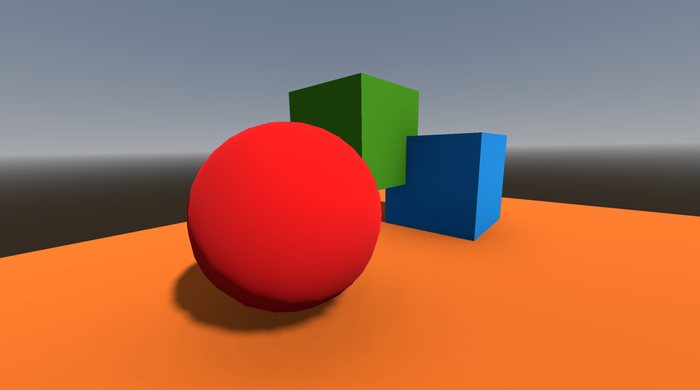
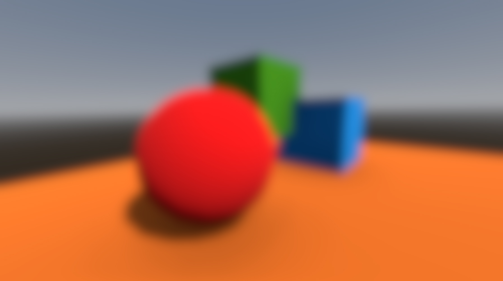
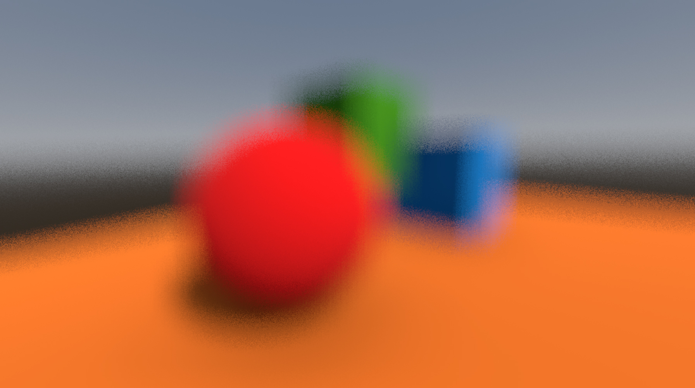

# Compositor Effect Example - Multipass Blur
This is an example of a two-pass blur compositor effect for use in Godot.

Base


Gaussian blur


Box blur with low samples


Box blur with low samples and dither


# Features
- Two pass blur filter. For a kernel size of N, a single pass blur would have N² calculations per pixel, whereas a two pass blur would only have N*2. For example, with a kernel width of 100, that's the difference between 10,000 operations per pixel versus 200 operations per pixel.
- Two blur types: Box blur and Gaussian blur.
- Sample count. Define a set number of samples independent of kernel size.
- Dithering to reduce effect of banding with low sample count.
- Perform blur on a downscaled version of the screen.

# Overview
I reccomend reading the [documentation on compositor effects](https://docs.godotengine.org/en/stable/tutorials/rendering/compositor.html) to get started, but in essence, a compositor effect has two parts: a script in Godot that collects data and sends it to a compute shader every frame, and a glsl compute shader that runs on the GPU.

Most people setup and dispatch their compute shader in the rendering callback method, and while this is fine for a single pass shader, dispatching a compute shader multiple times per frame isn't easy this way. You aren't able to call `submit()` or `sync()` on the rendering device from the rendering thread. I don't know how, but Godot handles this for you at some point.

If you simply move all the code from the `_render_callback()` method into it's own function, you can just call that multiple times per frame instead. Everything seems to run sequentially and sync up just fine.

# Buffers
We shouldn't write to the same image that we're reading from if our shader is going to sample from neighbouring pixels. To handle this we'll need to create some extra buffer textures.

The steps are:
- Read from the screen texture and write the horizontal pass to buffer1
- Read from buffer1 and write the vertial pass to buffer2
- Copy buffer2 to screen texture

So we'll need the screen texture and two additional buffers. We could skip buffer2 and write the second pass directly to the screen, but if we want to blur a smaller version of the screen, reading buffer2 as a `sampler2D` will allow us to leverage GPU bilinear interpolation.

We can get a copy of the screen texture from the `RenderData` that's passed to the callback function: 
```gdscript
var scene_buffers:RenderSceneBuffersRD = render_data.get_render_scene_buffers()
for view in scene_buffers.get_view_count():
    var screen_tex:RID = scene_buffers.get_color_layer(view)
```
Keep in mind this returns a texture for every `view`. There's normally only one view, but there could be two in a VR project. I'm not sure what else affects the view count, but I feel it's safe to assume any number of views going forward. This means we'll need a buffer1 and buffer2 for every view as well. Check the source code to see how I've handled this.

# Samplers and Images

In GLSL we'll be using both `image2D` and `sampler2D`. There are some differences you need to be aware of.

- **image2D**
  - need to define data format in uniform layout
  - coordinates are integers in x and y
  - can both read and write
- **sampler2D**
  - need to define a sampler state from Godot script when pushing uniform to pipeline
  - coordinates are float in range [0.0 - 1.0]
  - read only

 The main benefit of `sample2D` is that it doesn't matter what size it is, we can read from a scaled buffer by dividing `gl_GlobalInvocationID.xy` by the dimension of the `image2D` we're writing to. The interpolation happens automatically for us.
 
 Note that you will have to pass the buffers to the shader as samplers or images based off whether you are reading from it or writing to it.
 
 # Notes on push constant
Push constant is a byte array with a max size of 128 bytes (or 256 bytes if hardware allows). It's the fastest way to send data to the shader.

To pass values to the push constant in Godot you call `compute_list_set_push_constant()` on your `RenderingDevice` variable. It requires a `PackedByteArray` and it's size in bytes. The thing is, it only accepts array lengths in 16 byte increments. If your array is too small, you need to add padding. I've seen people do some math on their array size so it conforms to the required byte length, but there's no need for that. Just call `resize()` on your packed byte array with the desired size and it will add empty bytes to the end for you.

If you want to pass `int` and `float` to your push constant instead of bytes, which I'm sure you do, create and populate a `PackedFloat32Array` and/or `PackedInt32Array`. You can then append them to a PackedByteArray and send that to the shader.

```gdscript
var packed_bytes:PackedByteArray = PackedByteArray()
var packed_floats:PackedFloat32Array = PackedFloat32Array()
var packed_ints:PackedInt32Array = PackedInt32Array()

packed_floats.append(1.62)
packed_floats.append(3.14)

packed_ints.append(42)

packed_bytes.append(packed_floats.to_byte_array())
packed_bytes.append(packed_ints.to_byte_array())
packed_bytes.resize(16)

...
rendering_device.compute_list_push_constant(compute_list, packed_bytes, packed_bytes.size())
...
```
I think a packed `int` and `float` are 4 bytes each. But I just wait for Godot to complain about not supplying enough bytes and resize accordingly.

Remember that values need to be added in the same order as they are defined in the shader. And that values with multiple components like `vec2` and such need to have their components added individually.

# Known Issues
- When using dithering with very low samples, Temporal AntiAliasing causes ghosting of the un-blurred scene onto the blurred image during camera/object movements.
- Dithering doesn't look so good with downscaled buffers. It blurs the dithered pixels and makes them stand out more. It's probably best not to use dithering and resampling at the same time.
- Writing the screen to a buffer, then sampling that buffer as a `sampler2D` and writing back to the screen is *not* a 1:1 reproduction. There is some slight subpixel bluring. This also makes dithering look a little pronounced. I don't know how to mitigate this. It might just be how samplers work. Therefore, if you don't plan on downscaling your buffers, you would get slightly cleaner results by using image2D for everything and omitting the second set of buffers.


